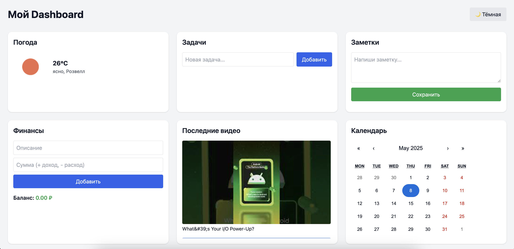

# 🧩 Personal Dashboard

Многофункциональный дашборд с заметками, задачами, погодой, финансами, видео и календарём.  
Создан для демонстрации навыков фронтенд-разработки.  
Поддерживает тёмную и светлую тему, работает без бэкенда — всё хранится в браузере.

---

## 🔗 Демо

👉 [Перейти к приложению](https://vercel.com/hlib-yelkhovs-projects/personal-dashboard)

---

## ⚙️ Возможности

- 🌤 Погода по геолокации
- ✅ Задачи с сохранением
- 📝 Заметки с автосохранением
- 💰 Финансовый трекер (доходы/расходы)
- 📺 Последние видео с YouTube канала
- 📆 Календарь с подсветкой текущего дня
- 🌙 Переключение светлой/тёмной темы
- 💾 Хранение всех данных в localStorage

---

## 🛠️ Стек

- **React** + **Vite**
- **Tailwind CSS**
- **React Calendar**
- **YouTube Data API**
- **LocalStorage**

---

## 🖼️ Скриншот



---

## 🌐 Деплой

Приложение в работе:  
👉 [personal-dashboard-gules.vercel.app](https://personal-dashboard-gules.vercel.app/)

---

## ⚙️ Установка и локальный запуск

```bash
git clone https://github.com/hlibyelkhov/personal-dashboard
cd personal-dashboard
npm install
npm run dev

